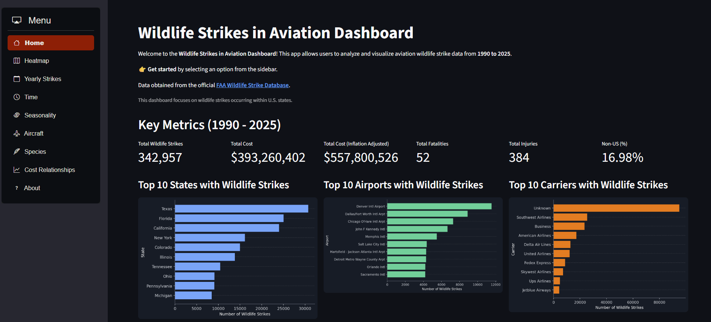

# Aviation Wildlife Strike Dashboard

An interactive Streamlit dashboard and two-stage hurdle model for analyzing and predicting financial damage from aviation wildlife strikes in U.S. airspace, built on the [FAA Wildlife Strike Database](https://wildlife.faa.gov/).



---

## Live App

[View on Streamlit Cloud](https://aviation-wildlife-strikes-v2.streamlit.app)

---

## Features

**Dashboard Pages**
- **Home** — key metrics and top airports, states, and carriers by strike volume
- **Damage Predictor** — pre-event strike risk assessment using a trained Random Forest classifier
- **Heatmap** — geographic distribution of U.S. strikes by year
- **Yearly Strikes** — long-term trend with COVID-19 annotation
- **Time** — strike frequency by hour of day and time-of-day category
- **Seasonality** — monthly and quarterly patterns driven by bird migration cycles
- **Aircraft** — breakdown by engine type and aircraft model
- **Species** — top 15 wildlife species by strike frequency

**Damage Predictor Model**
- Random Forest binary classifier predicting strike damage probability from pre-event flight parameters
- Hyperparameter tuning via Optuna with stratified cross-validation (class weights included)
- Classification threshold calibrated on held-out test set to balance precision/recall tradeoff

---

## Project Structure

```
aviation-wildlife-strikes/
├── app_utils/               # Streamlit app utilities
│   ├── data.py              # Parquet data loader
│   ├── aggregations.py      # Metric and aggregation functions
│   ├── filters.py           # Sidebar filter logic
│   ├── plotting.py          # Chart styling helpers
│   └── pages/               # One module per dashboard page
│       ├── home.py
│       ├── prediction.py
│       ├── heatmap.py
│       ├── yearly_strikes.py
│       ├── time_patterns.py
│       ├── seasonality.py
│       ├── aircraft.py
│       └── species.py
├── data/
│   ├── raw/                 # Source Excel file (not committed — see below)
│   └── processed/
│       ├── app/             # app_data_cleaned.parquet
│       └── modeling/        # modeling_matrices_package.zip
├── docs/                    # Additional documentation
├── logs/
│   └── tuning/              # Optuna experiment history and best params JSON
├── models/                  # Trained artifacts
│   ├── stage1_classifier.joblib
│   ├── stage2_regressor.joblib
│   └── stage1_threshold.json
├── outputs/
│   └── figures/             # Feature importance charts (generated by analyze_importance.py)
├── scripts/                 # Utility scripts
├── src/                     # ML pipeline
│   ├── app_data_cleaning.py # Cleans raw data → app parquet
│   ├── model_data_cleaning.py # Cleans raw data → modeling matrices
│   ├── tuning.py            # Optuna hyperparameter search
│   ├── train.py             # Final model training and evaluation
│   └── analyze_importance.py # Generates feature importance charts
├── app.py                   # Streamlit entry point
├── requirements.txt
└── requirements-dev.txt
```

---

## Setup

**1. Install dependencies**
```bash
pip install -r requirements.txt
```

**2. Add raw data**

Download `Public.xlsx` from the [FAA Wildlife Strike Database](https://wildlife.faa.gov/search) and place it at:
```
data/raw/Public.xlsx
```

**3. Run the data pipelines**
```bash
# Generate app dashboard data
python src/app_data_cleaning.py

# Generate modeling matrices
python src/model_data_cleaning.py
```

**4. Tune and train the model** *(skip if using committed model artifacts)*
```bash
python src/tuning.py       # Optuna hyperparameter search (~50 trials per stage)
python src/train.py        # Train final models and save to models/
python src/analyze_importance.py  # Generate feature importance charts
```

**5. Run the app**
```bash
streamlit run app.py
```

---

## Model Overview

**Random Forest Classifier — Damage Prediction**

The dashboard uses a Random Forest binary classifier to predict the probability that a wildlife strike results in reportable financial damage. The model is trained on ~58,000 FAA records (1990–2025) and uses only pre-event features available before a strike occurs:

- **Flight context:** Speed, altitude, aircraft mass class, engine type, operator category
- **Environmental:** Weather conditions (precipitation, sky), bird season, time of day
- **Spatial:** FAA region, latitude/longitude
- **Physics:** Log kinetic energy (wildlife size × speed²)

The model outputs a probability between 0 and 1; the dashboard applies a threshold of 0.55 to classify strikes as "high risk" for damage.

---

## Model Validation & Limitations

**Test Set Performance (20% held-out, n=58,085 strikes)**

| Metric | Value | Interpretation |
|--------|-------|-----------------|
| ROC-AUC | 0.860 | Strong discriminative ability |
| Precision-Recall AUC | 0.196 | Weak due to class imbalance |
| Sensitivity (Recall) | 29.9% | Catches ~30% of actual damage cases; misses 70% |
| Specificity | 97.4% | Correctly identifies non-damage cases 97% of the time |
| Precision | 22.2% | Only 1 in 5 positive predictions correct; 78% false alarms |
| F1-Score | 0.255 | Low overall balance due to imbalance |

**Class Distribution**
- Non-damage cases: 56,689 (97.6%)
- Damage cases: 1,396 (2.4%)
- **Imbalance ratio: 40.6:1**

**Key Limitations**

1. **Extreme class imbalance** — With only 2.4% positive cases, the model is inherently biased toward predicting "no damage." The ROC-AUC of 0.86 is somewhat misleading; the more honest metric (Precision-Recall AUC of 0.196) reflects the difficulty of identifying the minority class.

2. **Low sensitivity** — The model catches only ~30% of damage cases. For safety-critical applications, this miss rate is unacceptable. The threshold of 0.55 was auto-selected to maximize F1-score, but could be lowered to improve recall at the cost of more false positives.

3. **High false positive rate** — 78% of predicted damage cases don't actually result in reported damage. This inflates user alerts and may reduce trust in the tool.

4. **Limited feature set** — The model only uses flight parameters available before the strike. Real damage depends on complex factors not in the data: aircraft structural integrity, maintenance history, pilot evasion skill, strike angle, wildlife species, and whether the strike was reported at all (reporting bias).

5. **Reporting bias** — Not all strikes that cause damage are reported to the FAA, especially minor incidents. The training target (reportable damage) is a noisy proxy for true damage.

---

## Future Work

Potential improvements to explore:
- Lower decision threshold (0.35–0.40) to improve recall at the cost of more false positives
- Address class imbalance through resampling (SMOTE, downsampling) or cost-sensitive learning
- Feature engineering: interactions (speed × wildlife size), temporal patterns, aircraft-specific normalization
- Monitor threshold performance on new FAA data and retrain periodically

---

## Data

Source: [FAA Wildlife Strike Database](https://wildlife.faa.gov/) — publicly available records of wildlife strikes reported by airlines, airports, and pilots.

The raw data file is not committed to this repository due to size. Download it directly from the FAA and place it at `data/raw/Public.xlsx`.

---

## Author

**Vlad Lee** — Data Scientist (MIDS, UC Berkeley)

- [LinkedIn](https://www.linkedin.com/in/vlad-lee)
- [GitHub](https://github.com/Vlad-Lee/aviation-wildlife-strikes)
- vlad7984@gmail.com
